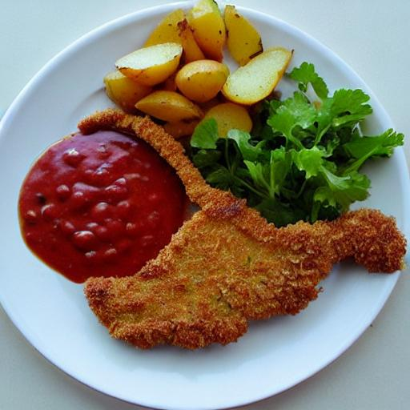
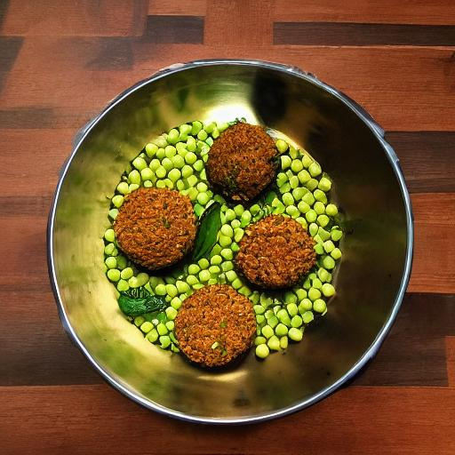

# unstable-mensa

A tiny script to generate photos of today's Mensa menu by stable diffusion.
Use it at your own risk.

```bash
# This will generate two images for menu 1 and 2
python src/unstable-mensa/main.py -o ./
```

`pork schnitzel (9,GlW,Gl,Ei,S), paprika dip (1,3,Sw,Sl,GlW,Gl,Veg), boiled potatoes (Vga), fresh herbs (Vga)`




`one pott pasta "peas and champignons" (GlW,Gl,So,Vga), falafel patty (Vga), garam masala style sauce (GlW,Gl,Vga), fresh herbs (Vga)`


